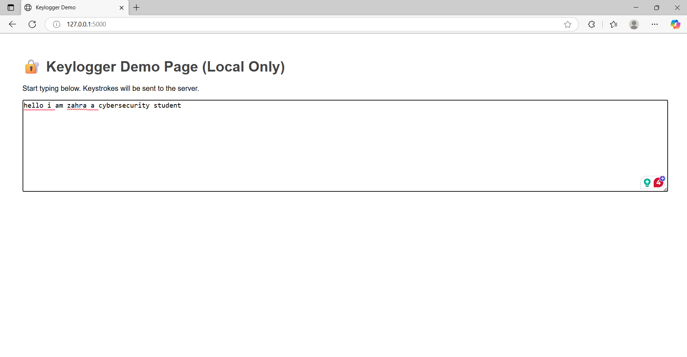
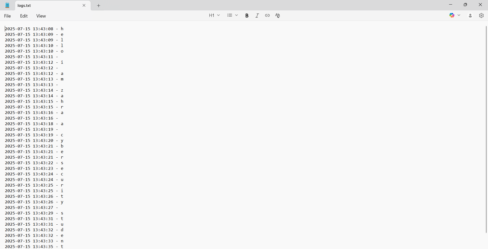

# 🧠 Web-Based Keylogger (Ethical Demo)

> 🔒 *DISCLAIMER: This project is built strictly for **educational* and *ethical testing* purposes — on your own system or with explicit consent in lab environments. Misuse is illegal and violates ethical hacking standards.

---

## 📌 Project Description

This is a simple *web-based keylogger* that captures and logs every keystroke typed into a webpage. It demonstrates how front-end JavaScript can be used with a Python Flask backend to simulate keystroke logging in a safe, controlled way.

---

## 🚀 How It Works

1. *Frontend*
   - HTML page with a <textarea> for input
   - JavaScript listens for all keydown events
   - Each keystroke is sent via fetch() to the backend as JSON

2. *Backend*
   - Flask server receives POST requests at /log
   - Each keystroke is logged to logs.txt with a timestamp

3. *Output*
   - A local file (logs.txt) that records key presses in real-time

---

## 🛠 Technologies Used

| Layer      | Tool              |
|------------|-------------------|
| Frontend   | HTML, JavaScript  |
| Backend    | Python + Flask    |
| Transport  | JSON over HTTP    |
| Output     | Text file logging |

---

## 📁 Project Structure
web-keylogger/

├── app.py               # Flask backend

├── logs.txt             # Output log file (auto-generated)

└── templates/

└── index.html           # Frontend interface

---

## 📸 Screenshots

### 🔐 Main Page



> This is a local-only interface with a textarea. Keystrokes are captured as you type.


---

## 🧪 Usage

### 1. Install Flask

```bash
pip install flask
